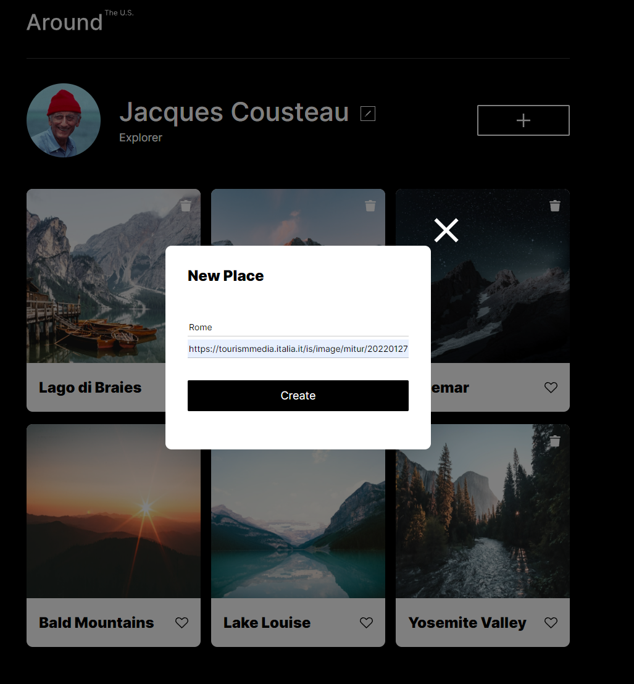
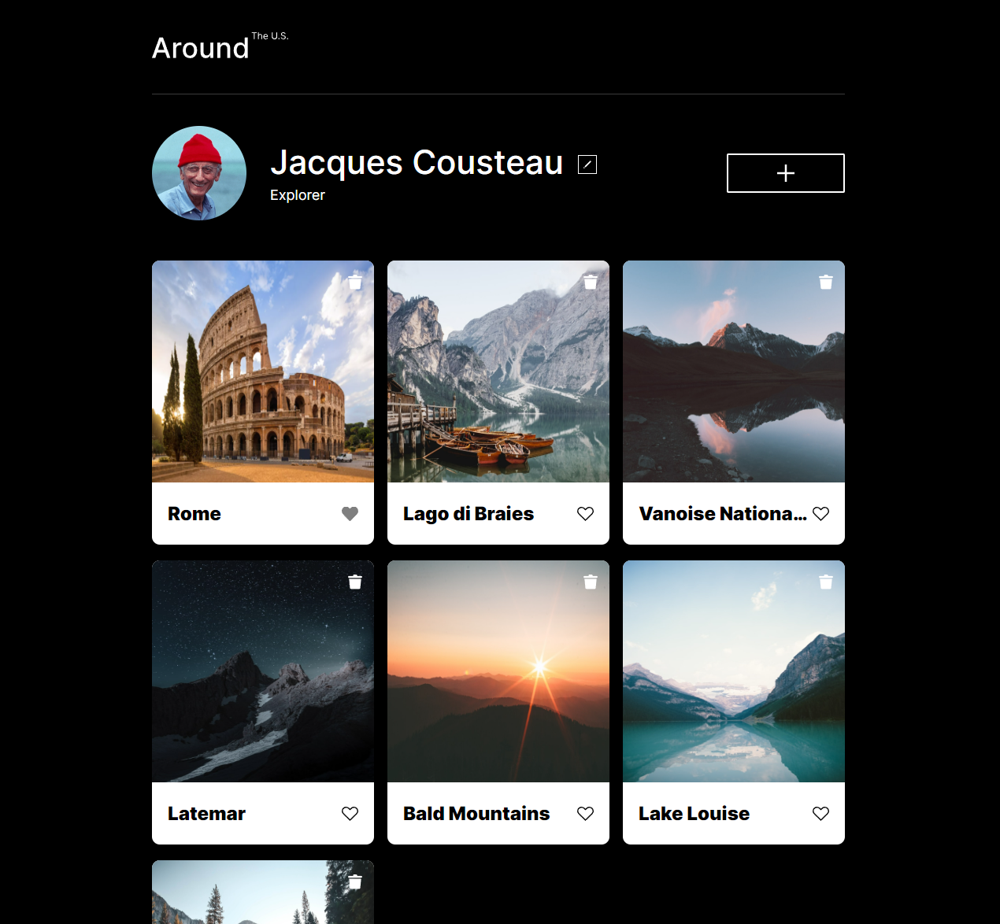
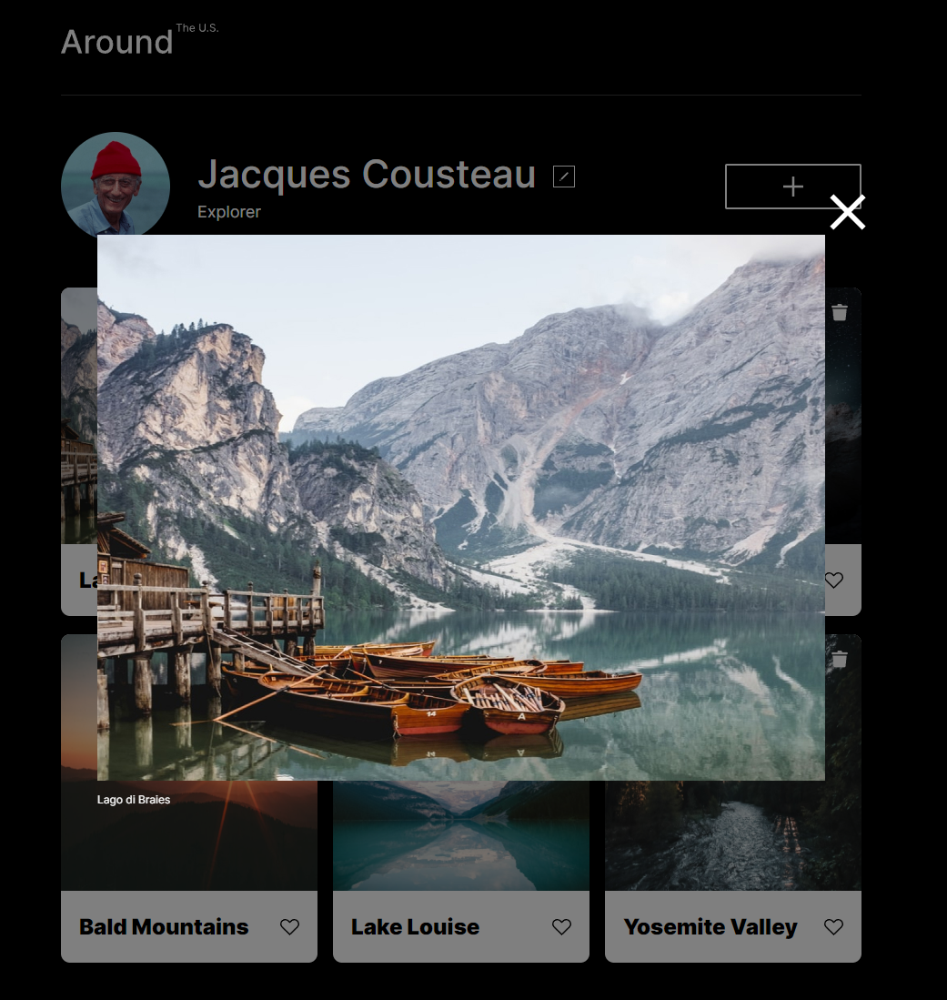

# Project 3: Around The U.S.

[Link to the project](https://tj-singh-portfolio.github.io/se_project_aroundtheus/index.html)

## Overview

In this project, I created a website that acts as a travel log. It has responsive design that works at a few common resolutions (320px, 800px, and 1280px). The resolutions between these breakpoints should still display the website fairly well. The website has two forms for submitting information and modifying the website's display. One form allows the user to change their name and description. The other form allows the user to add new locations to the site by entering a title and an image URL in the form. The location cards that are displayed have some functionality, such as being able to be "liked", being able to be deleted, and having their image be expanded and shown at a higher resolution if they are clicked. I used HTML, CSS, and JS to code the website. The technologies I used are CSS grid and flexbox, media queries, OOP, modules, loose coupling, and webpack.

## Demo Images

### Plans for Improvement

I plan on making the intermediate resolutions between the common ones more aesthetically pleasing.
